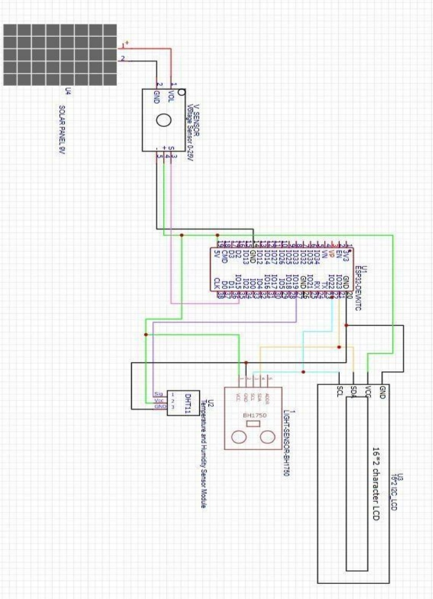

# ☀️ IoT-Based Solar Panel Monitoring System

A real-time solar panel monitoring system built with **ESP32**, designed to track voltage output, light intensity, temperature, and humidity — displayed locally on an LCD and uploaded to the **ThingSpeak** cloud dashboard over Wi-Fi.

> Rajiv Gandhi Institute of Technology, Mumbai | 2024–25
> Mahendra Kumar Prajapati
> **Guide:** Dr. S.V. Kulkarni

---

## 📌 Project Overview

Solar panels require constant monitoring to ensure optimal efficiency. Manual inspection is impractical — especially for remote installations. This project solves that by building a low-cost, scalable IoT monitoring system that:

- Measures key PV (photovoltaic) parameters in real time
- Displays data on a local 16×2 I²C LCD
- Transmits data over Wi-Fi to the **ThingSpeak** cloud every 20 seconds
- Enables remote monitoring and early fault detection

---

## 🔧 Hardware Components

| Component | Purpose | Pin (ESP32) |
|---|---|---|
| ESP32 DevKit | Microcontroller + Wi-Fi | — |
| Solar Panel (9V) | Power source under test | — |
| Voltage Sensor (0–25V) | Measures panel output voltage | PIN 35 |
| DHT11 | Ambient temperature & humidity | PIN 27 |
| BH1750 (GY-302) | Light intensity (lux) | SDA: PIN 21, SCL: PIN 22 |
| 16×2 I²C LCD | Local real-time display | SDA: PIN 21, SCL: PIN 22 |

---

## 🖥️ System Architecture

```
Solar Panel (9V)
      │
      ▼
Voltage Sensor ──────────────────────┐
                                     │
DHT11 (Temp & Humidity) ─────────► ESP32 WiFi Module ──► LCD Display
                                     │
BH1750 (Light Sensor) ───────────────┘
                                     │
                                     ▼
                              ThingSpeak Cloud
                           (Real-time Dashboard)
```

---

## 📦 Libraries Required

Install these via **Arduino IDE → Library Manager** (Sketch → Include Library → Manage Libraries):

| Library | Purpose |
|---|---|
| `WiFi.h` | Built-in ESP32 Wi-Fi |
| `HTTPClient.h` | HTTP requests to ThingSpeak |
| `Wire.h` | I²C communication |
| `LiquidCrystal_I2C` | LCD control |
| `DHT sensor library` by Adafruit | DHT11 temperature & humidity |
| `BH1750` by Christopher Laws | Light intensity sensor |

---

## ⚙️ Setup & Installation

### 1. Install Arduino IDE
Download from [arduino.cc](https://www.arduino.cc/en/software) and install the **ESP32 board package**:
- Go to **File → Preferences**
- Add this URL to "Additional Board Manager URLs":
  ```
  https://raw.githubusercontent.com/espressif/arduino-esp32/gh-pages/package_esp32_index.json
  ```
- Go to **Tools → Board → Board Manager**, search `esp32`, and install it

### 2. Install Required Libraries
Go to **Sketch → Include Library → Manage Libraries** and install:
- `DHT sensor library` (by Adafruit)
- `Adafruit Unified Sensor`
- `LiquidCrystal I2C`
- `BH1750`

### 3. Configure the Code
Open `solar_monitor.ino` and update these values:

```cpp
// Wi-Fi credentials (supports up to 4 networks)
const char* ssids[]     = {"YOUR_SSID1", "YOUR_SSID2", ...};
const char* passwords[] = {"YOUR_PASS1", "YOUR_PASS2", ...};

// ThingSpeak API Key
const char* apiKey = "YOUR_THINGSPEAK_API_KEY";
```

### 4. Set Up ThingSpeak
1. Create a free account at [thingspeak.com](https://thingspeak.com)
2. Create a new **Channel** with 4 fields:
   - Field 1: Temperature (°C)
   - Field 2: Humidity (%)
   - Field 3: Voltage (V)
   - Field 4: Light Intensity (lx)
3. Copy your **Write API Key** and paste it into the code

### 5. Upload the Code
- Connect your ESP32 via USB
- Select **Tools → Board → ESP32 Dev Module**
- Select the correct **Port**
- Click **Upload**

---

## 🗺️ Circuit Diagram



---

## 🔌 Circuit Connections

```
Solar Panel (+) ──► Voltage Sensor (IN+)
Solar Panel (-) ──► Voltage Sensor (GND)
Voltage Sensor (OUT) ──► ESP32 PIN 35

DHT11 (VCC) ──► 3.3V
DHT11 (GND) ──► GND
DHT11 (DATA) ──► ESP32 PIN 27

BH1750 (VCC) ──► 3.3V
BH1750 (GND) ──► GND
BH1750 (SDA) ──► ESP32 PIN 21
BH1750 (SCL) ──► ESP32 PIN 22

LCD (VCC) ──► 5V
LCD (GND) ──► GND
LCD (SDA) ──► ESP32 PIN 21
LCD (SCL) ──► ESP32 PIN 22
```

---

## 📊 Sample Results

| Voltage | Light Intensity | Temperature | Humidity |
|---|---|---|---|
| 0 V | 300 lx | 36.1 °C | 53% |
| 2.66 V | 1049.17 lx | 38.9 °C | 57% |
| 3.29 V | 2751.5 lx | 39.4 °C | 59% |
| 6.05 V | 53353.83 lx | 41.1 °C | 60% |

Data is pushed to ThingSpeak every **20 seconds** and visualized as time-series graphs.

---

## 🔄 Software Flow

```
Start → setup()
  ├── Serial.begin(115200)
  ├── connectWiFi() → print IP / retry
  ├── Wire.begin() + lcd.init()
  └── Show splash screens

loop() [every 20s]
  ├── readTemperature()
  ├── readHumidity()
  ├── readVoltage()
  ├── readLightIntensity()
  ├── updateLCD() [3 rotating screens]
  └── sendDataToThingSpeak()
```

---

## 🚀 Future Enhancements

- **Sun Tracking** — servo motors + quadrant photodiodes to maximize energy capture
- **Mobile App** — dedicated app for remote monitoring and alerts
- **MPPT Algorithm** — Maximum Power Point Tracking for better efficiency
- **Relay Control** — auto-control of connected loads based on readings
- **Predictive Maintenance** — ML-based fault detection

---

## 📁 Repository Structure

```
📦 iot-solar-panel-monitor
 ┣ 📄 solar_monitor.ino   ← Main Arduino sketch
 ┗ 📄 README.md           ← This file
```

---

## 📚 References

- [ThingSpeak IoT Platform](https://thingspeak.com)
- [Arduino Official Docs](https://www.arduino.cc)
- [ESP32 Documentation](https://docs.espressif.com)
- Electronics For You Magazine (EFY)

---

## 📜 License

This project was developed for academic purposes at RGIT Mumbai. Feel free to use and build upon it with attribution.
